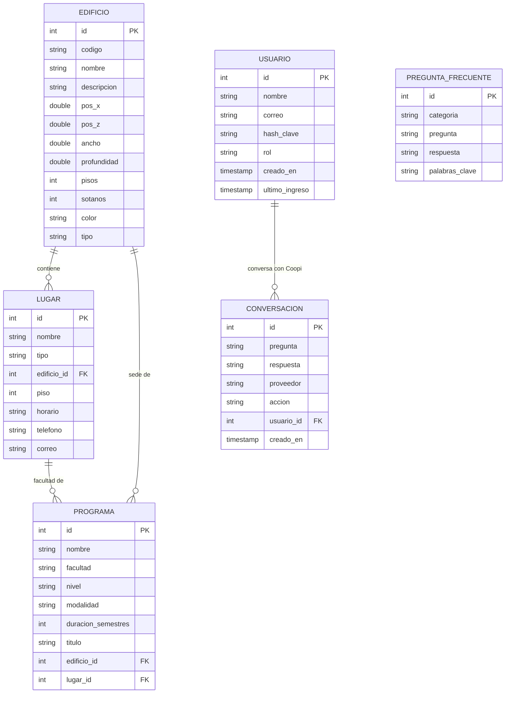

# Modelo entidad-relación

```mermaid
erDiagram
    EDIFICIO ||--o{ LUGAR : contiene
    EDIFICIO ||--o{ PROGRAMA : "sede de"
    LUGAR ||--o{ PROGRAMA : "facultad de"
    USUARIO ||--o{ CONVERSACION : "conversa con Coopi"
    EDIFICIO {
        int id PK
        string codigo
        string nombre
        string descripcion
        double pos_x
        double pos_z
        double ancho
        double profundidad
        int pisos
        int sotanos
        string color
        string tipo
    }
    LUGAR {
        int id PK
        string nombre
        string tipo
        int edificio_id FK
        int piso
        string horario
        string telefono
        string correo
    }
    PROGRAMA {
        int id PK
        string nombre
        string facultad
        string nivel
        string modalidad
        int duracion_semestres
        string titulo
        int edificio_id FK
        int lugar_id FK
    }
    PREGUNTA_FRECUENTE {
        int id PK
        string categoria
        string pregunta
        string respuesta
        string palabras_clave
    }
    USUARIO {
        int id PK
        string nombre
        string correo
        string hash_clave
        string rol
        timestamp creado_en
        timestamp ultimo_ingreso
    }
    CONVERSACION {
        int id PK
        string pregunta
        string respuesta
        string proveedor
        string accion
        int usuario_id FK
        timestamp creado_en
    }
```

